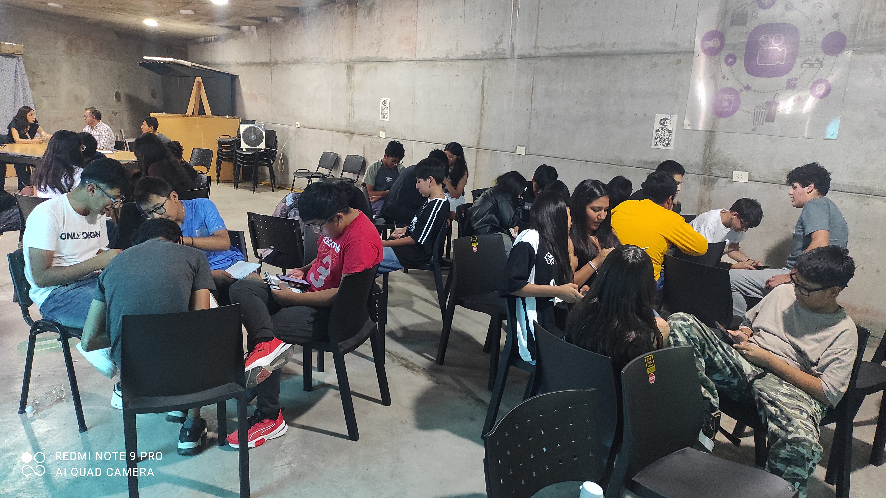
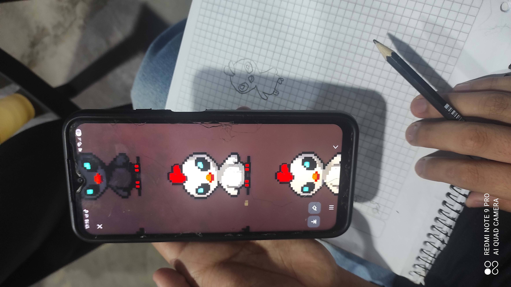
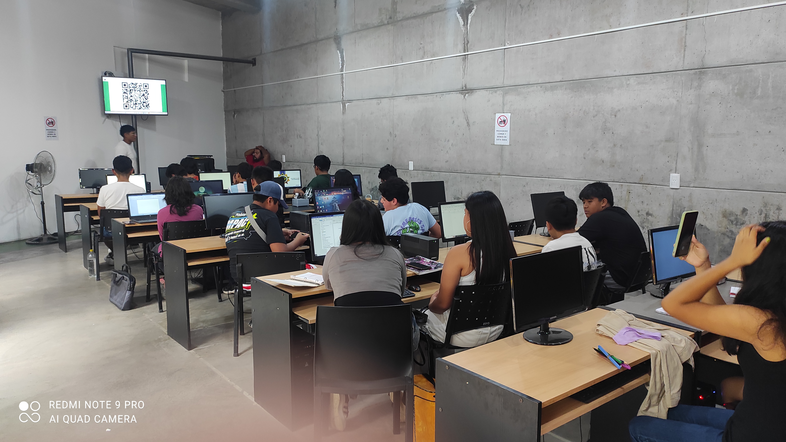
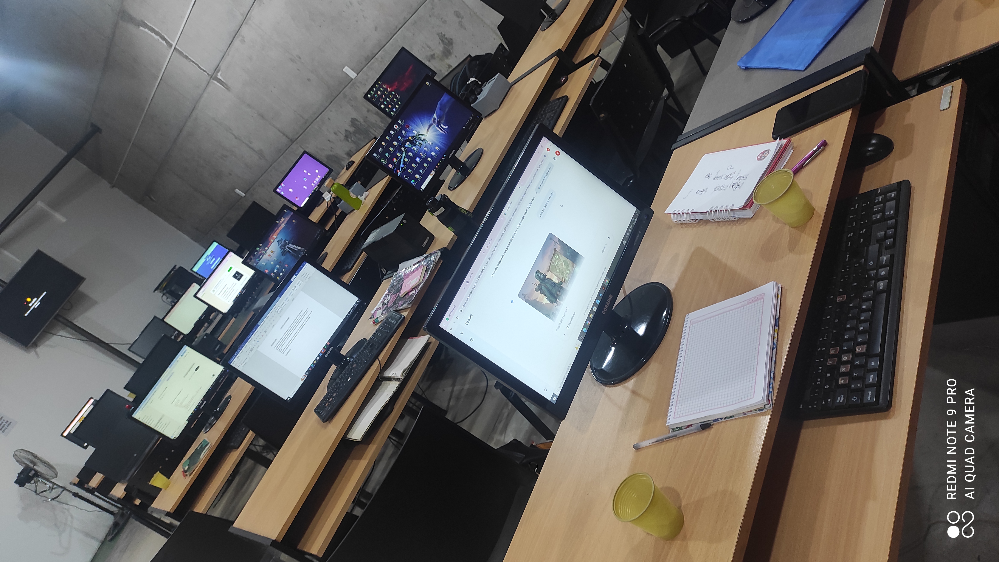
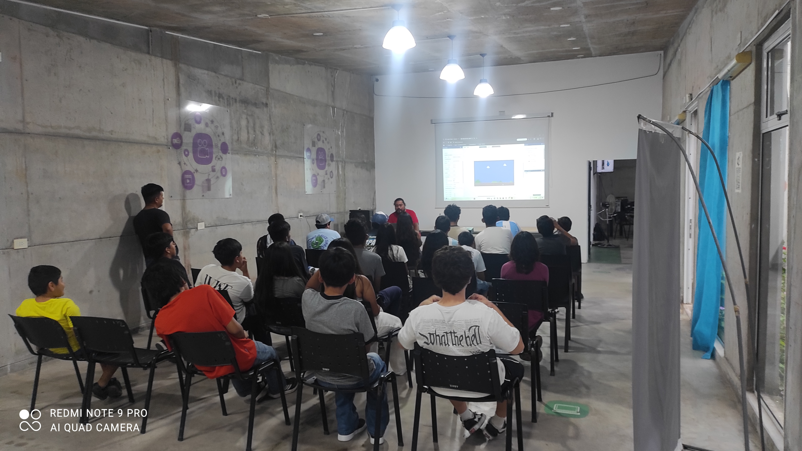
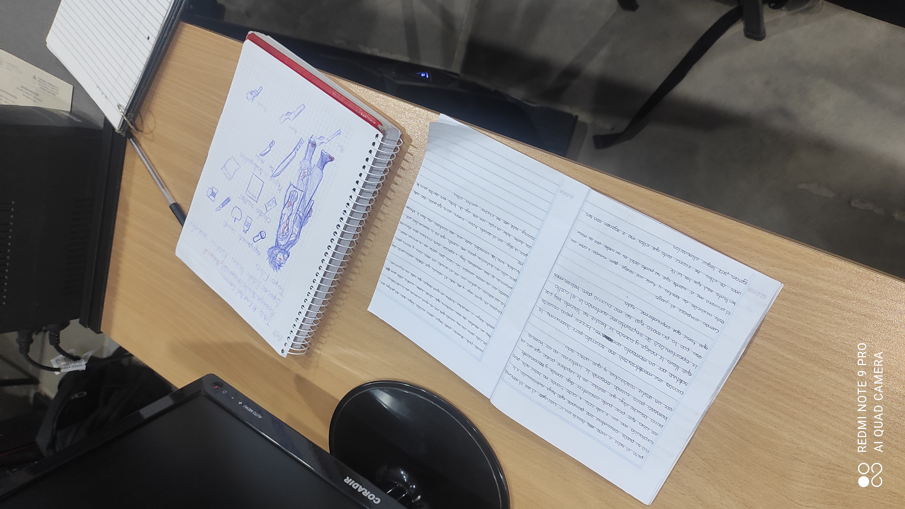
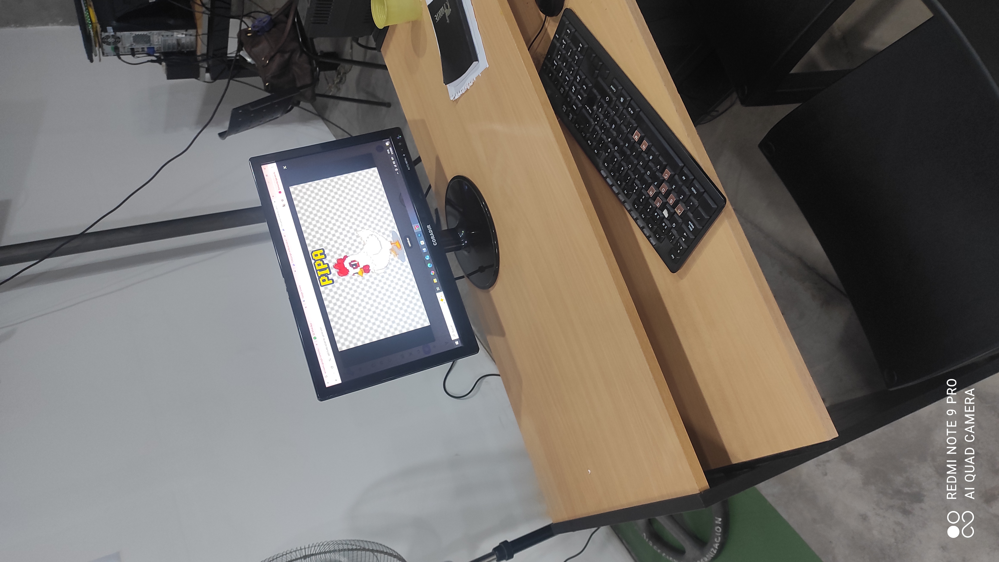

# 📸 Experiencia GGJNext - Punto Digital Jujuy

¡Así se vivió la capacitación! Aquí compartimos el proceso de trabajo y la energía de los chicos en Jujuy.

## 🛠️ Manos a la obra

En estas imágenes pueden ver cómo los equipos empezaron a prototipar sus ideas y a usar las herramientas de IA y diseño.

  
  

  
  
  

---

## 💡 El Proceso Creativo

Desde los primeros bocetos en papel hasta ver sus juegos funcionando en la pantalla.

  
  
   
  <em>Los chicos trabajando en equipo en sus propuestas finales.</em>

---

> [!TIP] > **Punto Digital Jujuy:** Un espacio de encuentro, aprendizaje y creación de videojuegos para el futuro.
