# 🤖 Guía Práctica: Cómo usar la Inteligencia Artificial

Esta guía te mostrará, paso a paso, cómo integrar herramientas de IA en tu proceso creativo para la **GGJNext 2026**.

---

## 🚀 Proceso de Trabajo con IA

  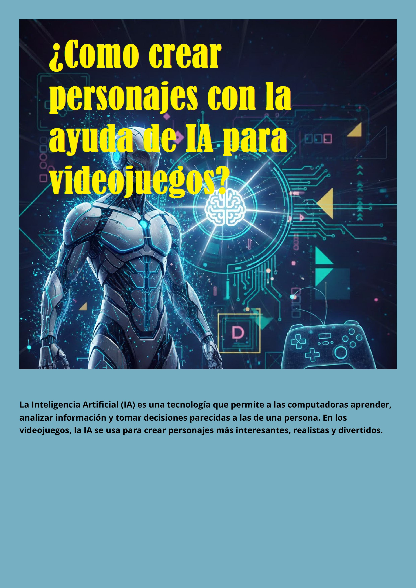

---

  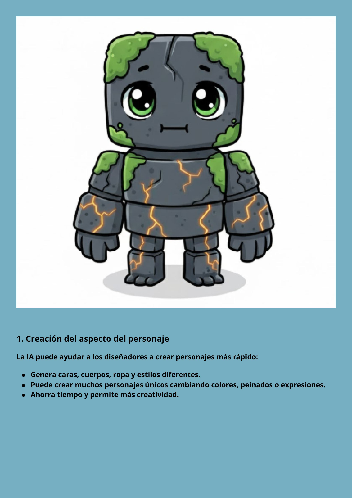
  

---

  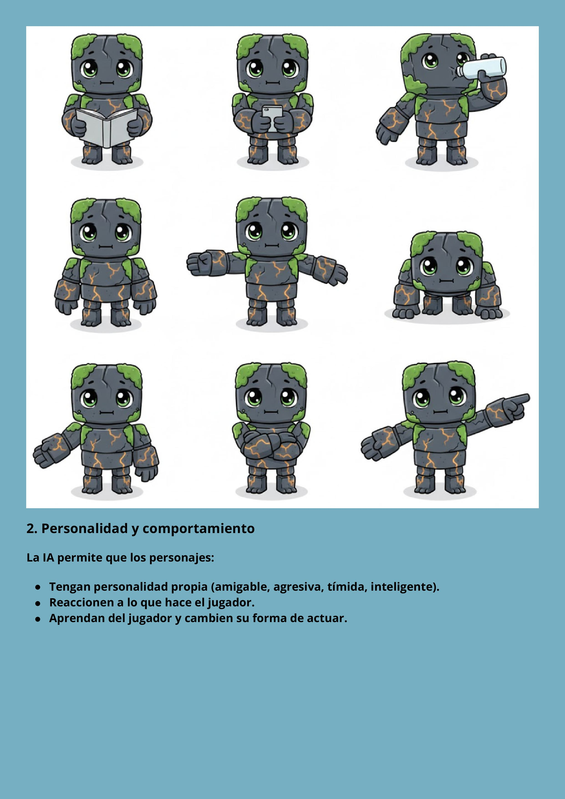

---

  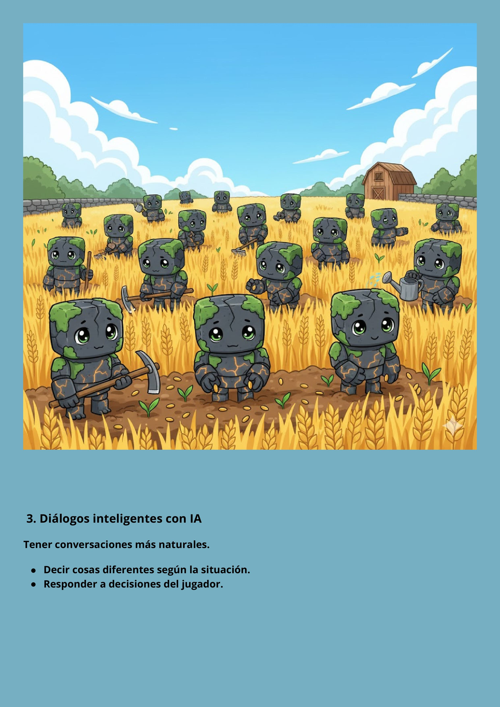

---

 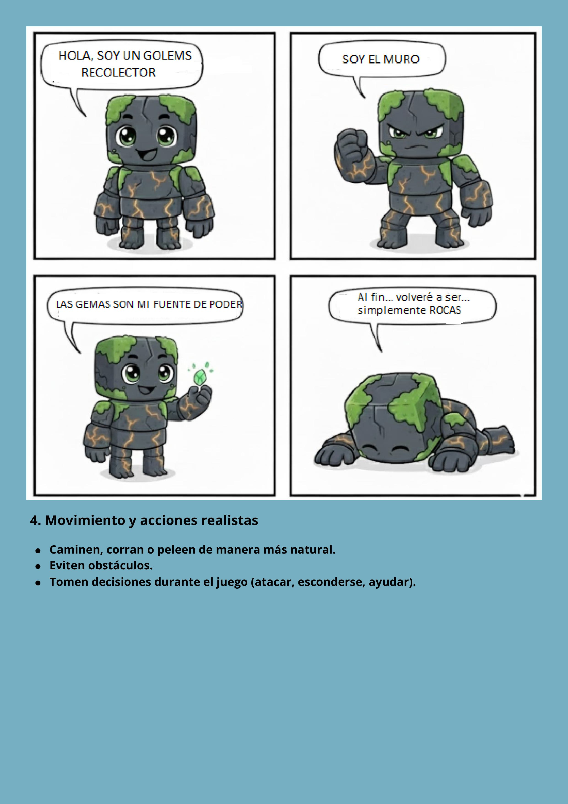

---

  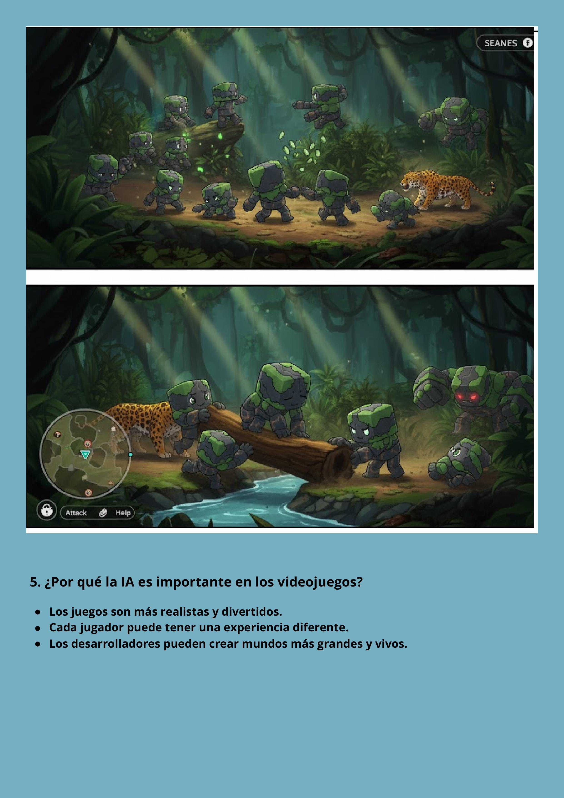

---

  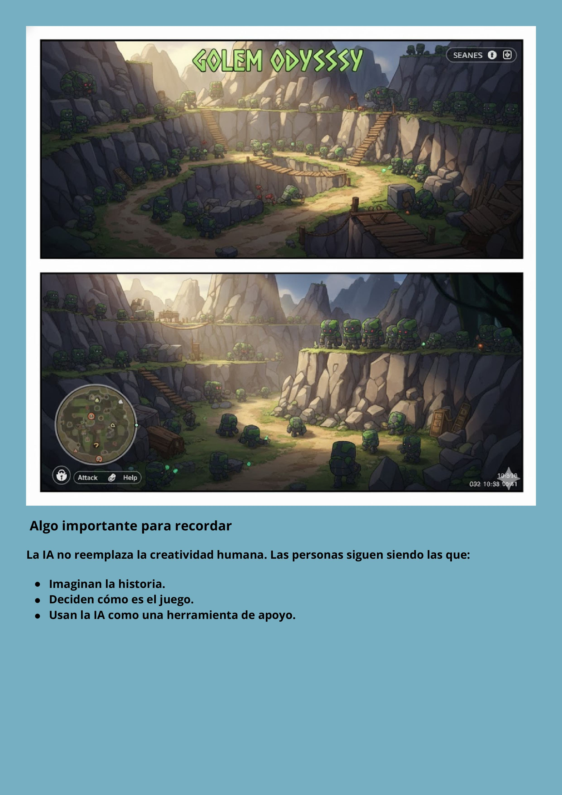

---

  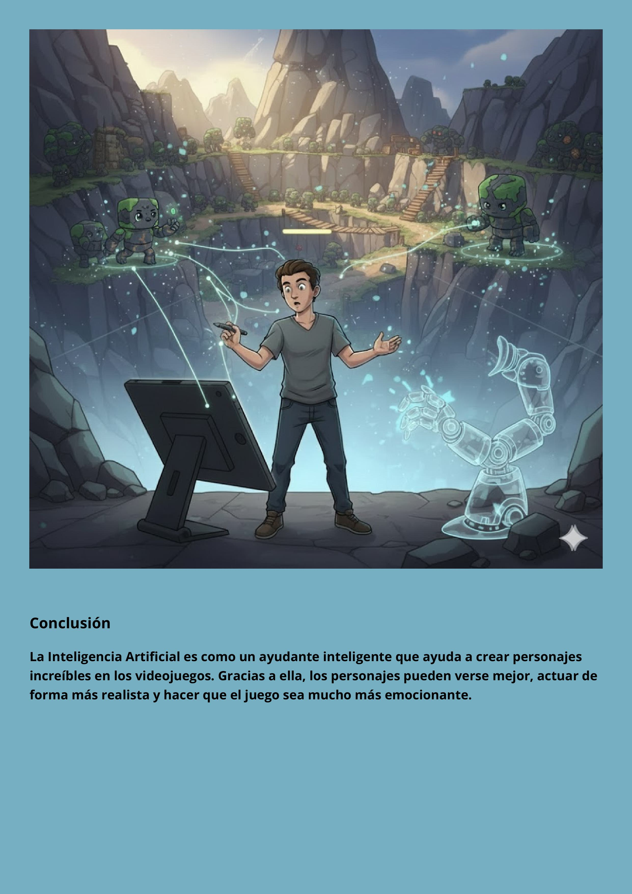

---

  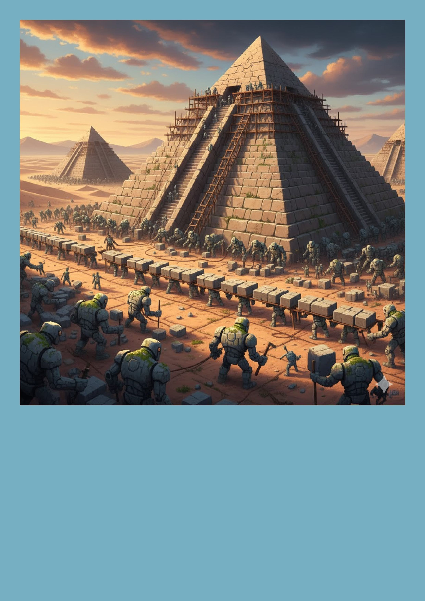

---

  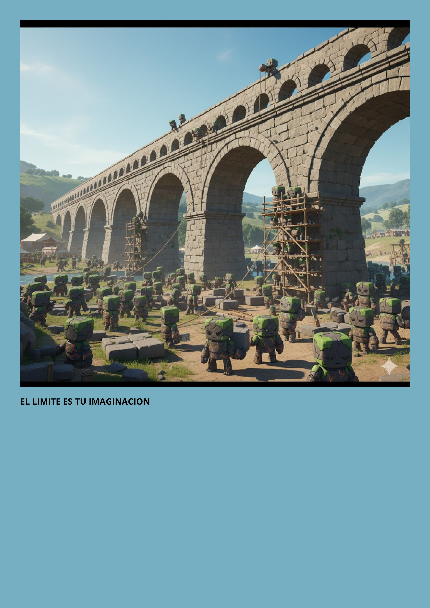

---

 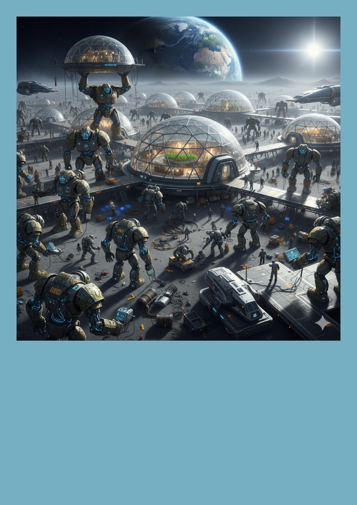

---

  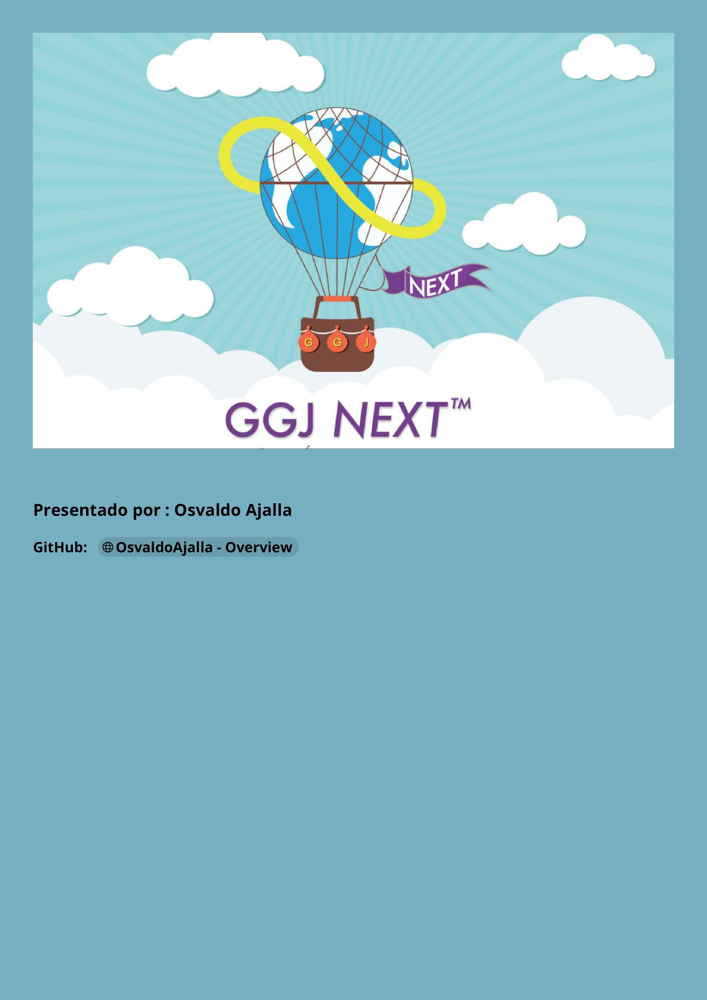

---

  

---

> [!NOTE]
> Recordá que la IA es una **asistente creativa**. La decisión final y el toque original siempre dependen de vos y tu equipo.

---

### ✍️ Créditos del Material

Este recurso didáctico ha sido desarrollado por:

<table>
  <tr>
    <td align="center">
      <a href="https://github.com/OsvaldoAjalla">
         
        <b>Osvaldo Ajalla</b>
      </a> 
      🚀 Colaborador del Proyecto
    </td>
    <td>
      <b>Contribución:</b> 
      Desarrollo conceptual de la guía y materiales visuales para la capacitación 2026.
    </td>
  </tr>
</table>

---
